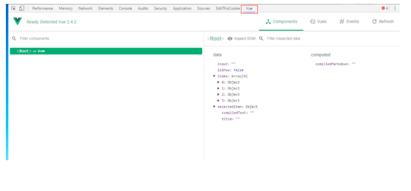
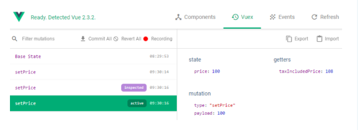

# Vue.js Devtools

Vue.js Devtools は、Vue.jsの開発をサポートするChromeブラウザの拡張機能です。

Vue.js Devtools を利用して、開発中の Vue.js アプリケーションの
様々なデバッグ向け情報を取得することができます。

## Vue.js Devtool のインストール

Vue.js Devtool は chrome の webstore からインストール可能です。

https://chrome.google.com/webstore/detail/vuejs-devtools/nhdogjmejiglipccpnnnanhbledajbpd?hl=ja

拡張機能を追加したら、拡張機能の設定画面を開き、
「ファイルのURLへのアクセスを許可する」にチェックを入れます。
 
  

拡張機能をインストール後に、Chrome で Vue.jsアプリケーションを開くと、
Vue.js Devtoolsのアイコンがアクティブになります。
デベロッパールールに「vue」というタブが追加されているので、そこから Vue.js アプリケーションの情報を取得することができます。

## Vue.js Devtoolsの各タブの機能について

拡張機能のインストールが完了したら、
Vue.js Devtoolsの機能を確認していきましょう。

### Components  

Componentsタブでは、各コンポーネントの親子関係や
Vue コンポーネントごとの 内部データの状況などを確認することができます。
  

### Vuex 
 
Vuexタブでは、Vuex Store のの状態を確認できます。

state の状態だけでなく、
mutation がコールされるたびにその履歴が時系列順に表示されるため、
Vuex モジュールの挙動把握に役立ちます。

### Events

Events タブでは、Vue.js アプリケーションで発行された、
イベントの一覧とその履歴を確認することができます。

